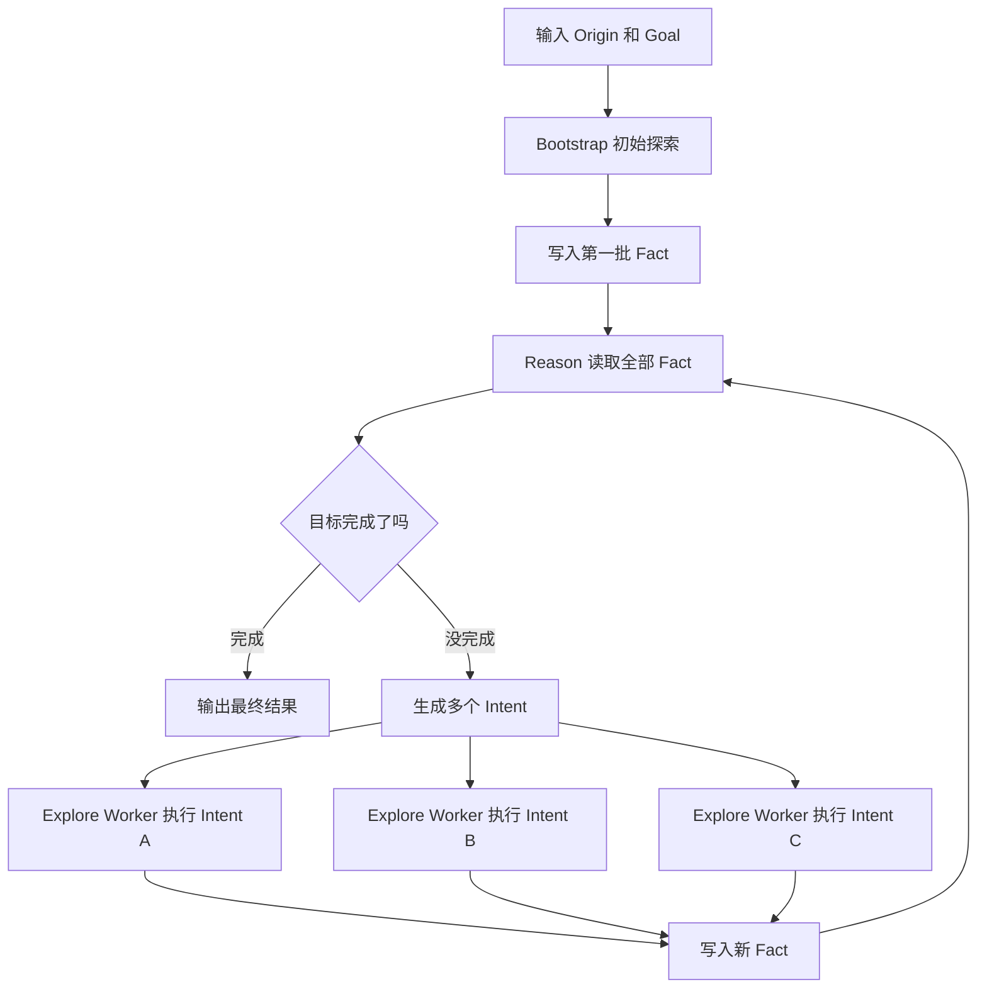

# AI Agent 渗透测试研究对话上下文

> 用途：下次对话时，直接让 AI 读取这份文件，就能快速理解前面的讨论背景。
>
> 位置建议：`D:\笔记\AI\AI-Agent-渗透测试研究对话上下文.md`
>
> 记录日期：2026-05-28

## 1. 我当前的研究目标

我正在研究如何把 AI Agent 用到实际授权渗透测试中。

我的核心诉求是：

```text
减少重复、枯燥的渗透测试任务。
让 AI 帮我整理攻击面、拆分任务、记录发现。
让 AI 对测试结果进行查漏补缺。
不要只是“聊天式回答”，而是希望形成可持续使用的方法和工具链。
```

我不是只想看项目介绍，而是想理解这些项目的设计思想，并判断怎么落地到实际工作里。

## 2. 已经讨论过的项目

目前重点讨论了两个项目：

```text
1. Cairn
   https://github.com/oritera/Cairn

2. Mastermind Bug Bounty
   https://github.com/jinyimeng01/mastermind-bug-bounty/blob/main/README_CN.md
```

## 3. Cairn 是什么

### 一句话理解

Cairn 像一个“AI 渗透测试任务调度系统”。

它不是简单让一个 AI 一口气完成所有测试，而是：

```text
记录已确认事实
根据事实规划下一步
把任务分给不同 AI Worker
Worker 执行后再写回新事实
不断循环，直到目标完成
```

### 用渗透测试语言理解

```text
你 = 渗透测试负责人
Cairn = 项目经理 + 任务看板 + 调度器 + 记录员
AI Worker = 被派出去干活的小助手
Fact = 已经确认的发现
Intent = 下一步要查的方向
Hint = 你给 AI 的人工提示
```

## 4. Cairn 的三个核心概念

### Fact：已确认事实

Fact 必须是已经确认的东西。

例如：

```text
目标 192.168.1.10 的 80 端口开放。
/login 接口存在。
普通用户访问 /api/admin/users 返回 403。
前端 JS 中发现 /api/order/detail 接口。
```

不应该写成 Fact 的内容：

```text
这个站可能有 SQL 注入。
感觉这里可以越权。
下一步应该试试弱口令。
```

这些只是猜测、判断或计划，不是确认事实。

### Intent：待办任务

Intent 是下一步要执行的具体测试方向。

好的 Intent：

```text
验证 /api/admin/users 是否存在普通用户越权访问。
提取 main.js 中所有 API 路由。
检查订单详情接口是否存在水平越权。
```

不好的 Intent：

```text
继续测试。
看看有没有漏洞。
深入挖一下。
```

### Hint：人工提示

Hint 是人类经验、限制和重点。

例如：

```text
这是授权测试，只允许测试 example.test 和 api.example.test。
不要进行拒绝服务测试。
不要修改或删除业务数据。
重点关注未授权访问、越权和敏感信息泄露。
客户提供了普通用户账号。
```

Hint 很重要，因为它能让 AI 少走弯路，也能限制 AI 不做危险动作。

## 5. Cairn 的工作流程

Cairn 的主循环可以理解为：

```text
你输入 Origin 和 Goal
  ↓
Bootstrap 先做初始探索
  ↓
写入第一批 Fact
  ↓
Reason 读取所有 Fact，判断下一步
  ↓
如果目标没完成，生成多个 Intent
  ↓
Explore Worker 分别执行 Intent
  ↓
写入新的 Fact
  ↓
Reason 再次读取 Fact
  ↓
循环，直到 Goal 完成
```

Mermaid 流程图：



## 6. Cairn 的 Prompt 是怎么设计的

Cairn 默认有 5 类 prompt：

```text
bootstrap.md
reason.md
explore.md
bootstrap_conclude.md
explore_conclude.md
```

### Bootstrap Prompt

作用：刚开始时，先帮我开个头。

通俗理解：

```text
你是第一个上场的助手。
现在只知道起点、目标和人类提示。
请先尝试推进任务。
如果目标已经达成，就说明证据。
如果目标没达成，就只返回你确认的新事实。
不要输出猜测。
只输出 JSON。
```

### Reason Prompt

作用：根据已有事实，规划下一步。

通俗理解：

```text
你是规划助手。
请阅读完整记录本。
判断目标是否完成。
如果没完成，请生成几个具体、可执行、不重复的下一步任务。
每个任务必须基于已有事实。
不要生成空泛任务。
只输出 JSON。
```

### Explore Prompt

作用：执行一个具体 Intent。

通俗理解：

```text
你是执行助手。
你只能执行当前分配给你的任务。
不要扩大范围。
不要重复已有发现。
如果发现新东西，返回一个新 Fact。
如果没查到，也返回确认过的失败结果或阻塞点。
只输出 JSON。
```

### Conclude Prompt

作用：当 AI 快超时、输出混乱、没正常返回 JSON 时，让它停止继续探索并总结已确认结果。

通俗理解：

```text
停止继续操作。
不要再运行命令。
不要再发起新请求。
只总结已经确认的信息。
按 JSON 返回结果。
```

## 7. Cairn 对我做渗透测试的价值

Cairn 适合帮我做：

```text
整理攻击面
根据发现拆分下一步测试任务
并行验证多个低风险方向
记录哪些点已经测过
提醒还有哪些方向没覆盖
把测试过程变成结构化笔记
```

不适合完全交给 Cairn 的部分：

```text
高危破坏性操作
影响生产数据的操作
最终漏洞定级
最终报告结论
客户授权边界判断
业务影响判断
```

实践上，它更适合作为：

```text
任务管家
查漏补缺助手
结构化记录系统
低风险测试方向的并行执行器
```

## 8. 如何写 Cairn 的 Origin、Goal、Hint

### Origin 示例

```text
授权测试目标：
https://example.test
https://api.example.test

测试范围：
只允许测试上述两个域名。

已有信息：
客户提供了普通用户账号 user_a。
当前只允许进行非破坏性 Web 安全测试。
```

### Goal 示例

```text
识别 Web 应用中的高风险入口。
重点检查未授权访问、水平越权、垂直越权、敏感信息泄露、文件上传和注入风险。
输出可复核的确认事实、疑似风险和未覆盖点。
```

### Hint 示例

```text
不要进行拒绝服务测试。
不要批量爆破。
不要修改或删除业务数据。
重点关注普通用户到管理员功能的越权。
如果发现疑似漏洞，只做最小化验证。
所有结论必须能被 HTTP 请求和响应证明。
```

## 9. Mastermind Bug Bounty 是什么

### 一句话理解

Mastermind Bug Bounty 更像“AI 漏洞赏金工作流规范系统”。

它不是重点做并行探索，而是重点管住 AI：

```text
让 AI 记住上下文
让 AI 记录工作日志
让 AI 不要过早放弃
让 AI 提交发现前先过审核
让 AI 会话结束时生成交接文档
```

### 它更像什么

```text
Cairn 像自动派人干活的任务调度系统。
Mastermind 像监督 AI 按规范做渗透测试的流程管控系统。
```

## 10. Mastermind 的主要机制

根据 README_CN，它围绕几个 Hook 做工作：

```text
上下文注入器
协调器守护
分级审核门
工作日志记录器
重试检测器
交接保存器
```

通俗理解：

```text
开始时：读取历史上下文。
执行前：检查当前动作是否合适。
提交发现前：检查证据、影响、置信度。
执行后：写工作日志。
AI 想放弃时：要求它重新评估。
结束时：保存交接文档，方便下次继续。
```

## 11. Cairn 和 Mastermind 的共同点

它们都想解决 AI 做安全测试时的几个问题：

```text
AI 容易忘记上下文。
AI 容易重复做已经做过的事。
AI 容易把猜测当发现。
AI 容易过早放弃。
AI 输出不稳定。
AI 的测试过程难以复盘。
```

两者都强调：

```text
记录过程
结构化输出
区分事实和猜测
让测试过程可复核
减少重复工作
```

## 12. Cairn 和 Mastermind 的不同点

| 对比项 | Cairn | Mastermind Bug Bounty |
| --- | --- | --- |
| 本质 | 状态空间搜索引擎 | 漏洞赏金工作流/技能系统 |
| 更像什么 | 自动探索路线的人 | 管住 AI 测试流程的人 |
| 核心目标 | 从起点搜索到目标 | 让 AI 按安全测试规范稳定工作 |
| 主要机制 | `Fact / Intent / Hint` 图 | `ledger.json`、`worklog.jsonl`、`handoff.md` |
| 工作流 | `Bootstrap -> Reason -> Explore` | 多个 Hook 生命周期 |
| 强项 | 自动拆任务、并行探索、查漏补缺 | 日志、审核、交接、避免过早放弃 |
| 适合场景 | 自动渗透、CTF、路径未知的问题 | Bug bounty、长期测试、持续交接 |
| 风格 | 更偏“搜索和执行” | 更偏“纪律和流程” |

## 13. 二者最关键的区别

最简单的理解：

```text
Cairn 负责探索。
Mastermind 负责管控。
```

更具体一点：

```text
Cairn 问的是：
现在已知什么？下一步该查什么？派谁去查？

Mastermind 问的是：
你这样查合不合理？有没有记录？证据够不够？下次能不能接着干？
```

## 14. 最适合我的组合思路

如果我要做一个真正可用的 AI 渗透测试助手，可以这样组合：

```text
Cairn 的思想：
用 Fact / Intent / Hint 管理状态。
用 Reason 生成下一步任务。
用 Explore 执行单个任务。

Mastermind 的思想：
每一步写日志。
提交发现前做审核。
AI 过早放弃时要求重试。
会话结束时保存交接文档。
```

组合后的理想形态：

```text
AI 先读取历史上下文
  ↓
根据 Fact 生成 Intent
  ↓
Worker 执行单个 Intent
  ↓
结果写入 Fact
  ↓
同时写入 worklog
  ↓
疑似漏洞进入审核门
  ↓
证据不足就继续验证
  ↓
结束时生成 handoff
```

## 15. 对下次对话的要求

下次对话时，如果我让你读取这份文档，请你直接理解为：

```text
我正在研究 AI Agent 如何辅助授权渗透测试。
我已经理解了 Cairn 和 Mastermind 的基本定位。
我更需要你帮我把这些思想变成实际可用的工作流、prompt、配置、代码或工具。
请尽量用通俗语言解释。
不要只讲抽象概念。
最好结合渗透测试实际场景。
如果需要写文档，请写得方便重复阅读。
```

## 16. 后续可以继续研究的方向

后续可以从这些方向继续：

```text
1. 把 Cairn 的 Fact / Intent / Hint 思想改造成我的渗透测试笔记模板。
2. 设计一套适合授权渗透测试的 Origin / Goal / Hint 输入模板。
3. 写一套 Planner Prompt、Worker Prompt、Reviewer Prompt。
4. 研究怎么把 Mastermind 的日志和审核机制加到我的工作流里。
5. 搭建一个最小可用版本：本地 JSON 文件 + AI Prompt + 手工执行。
6. 再进一步考虑是否接入 Docker、代理、浏览器、扫描器等工具。
```

## 17. 当前已经生成过的文件

已经生成并推送过一份 Cairn prompt 通俗解读：

```text
本地：
D:\笔记\AI\Cairn-Prompt-解读.md

GitHub：
https://github.com/yanyu2000119/About-my-AI-agent-thinking/blob/main/Cairn-Prompt-%E8%A7%A3%E8%AF%BB.md
```

该文档重点解释：

```text
Cairn 是什么
Fact / Intent / Hint 是什么
Bootstrap / Reason / Explore / Conclude prompt 怎么工作
如何用于授权渗透测试
如何写 Origin / Goal / Hint
```

## 18. 最短总结

```text
Cairn = 帮 AI 自动探索和拆任务。
Mastermind = 管住 AI 的工作流程、日志、审核和交接。

对授权渗透测试来说：
Cairn 适合用来查漏补缺和减少重复探索。
Mastermind 适合用来保证过程可复核、证据充分、下次能接着做。

真正有价值的方向：
把 Cairn 的探索能力和 Mastermind 的流程管控结合起来。
```
