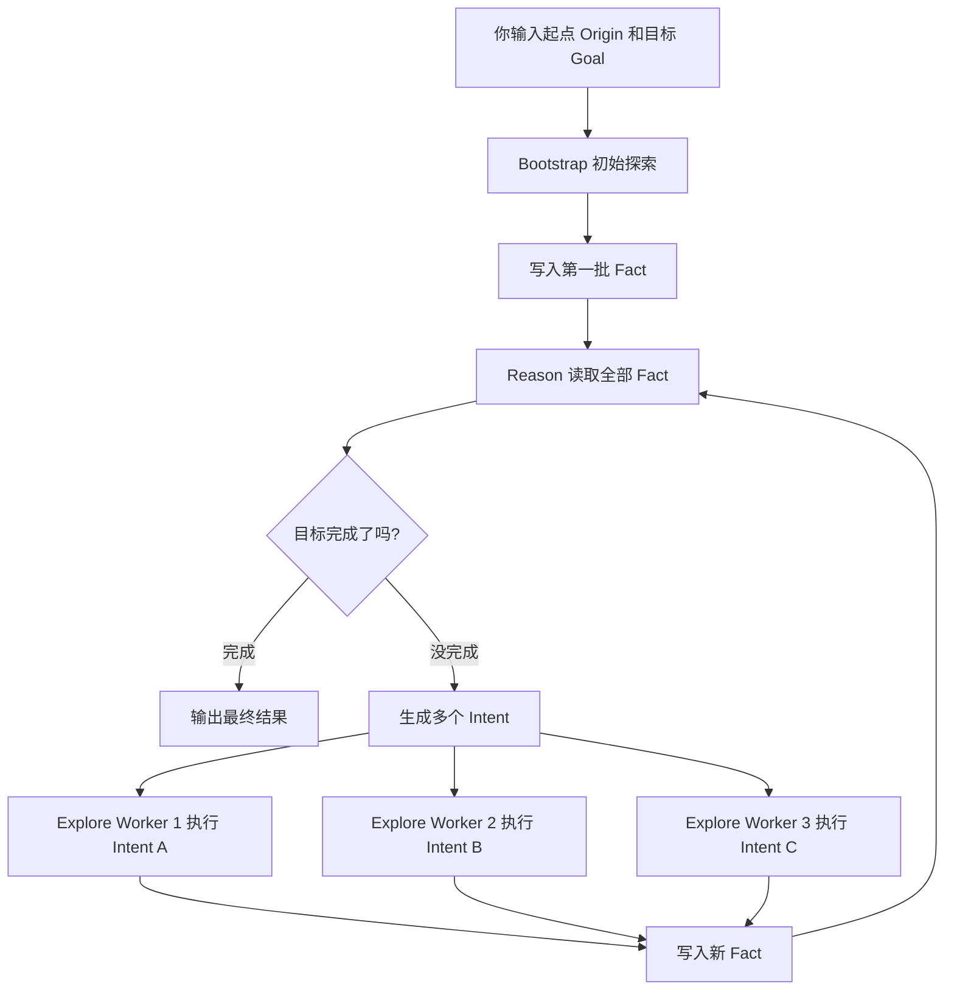
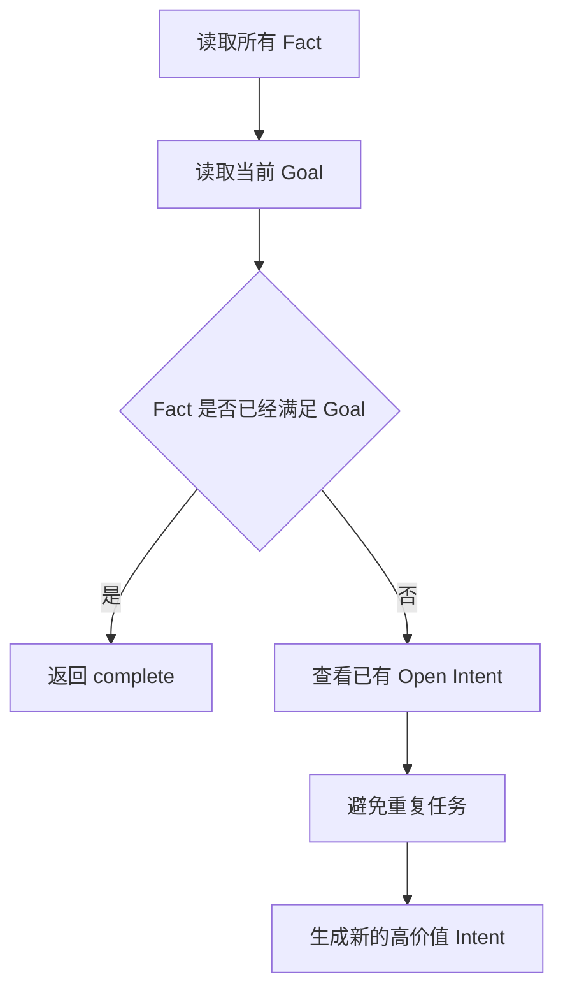
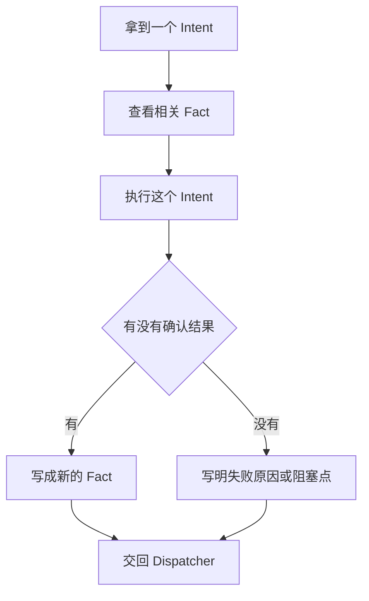
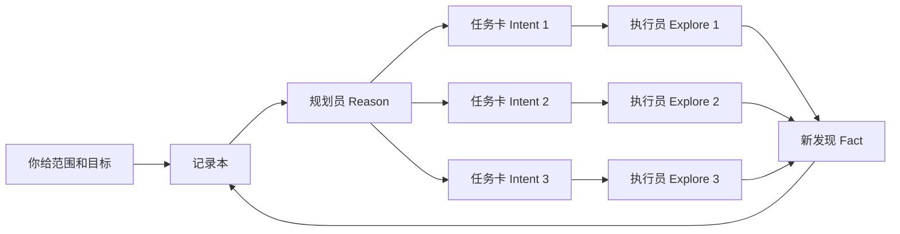

# Cairn Prompt 超通俗解读：把它当成一个渗透测试任务管家

> 阅读对象：[`oritera/Cairn`](https://github.com/oritera/Cairn)
>
> 阅读日期：2026-05-28
>
> 这篇不是逐字翻译源码里的 prompt，而是用更容易理解的方式解释：Cairn 到底让 AI 怎么工作，以及你做授权渗透测试时怎么借鉴它。

## 先说人话版

Cairn 不是一个“自动黑掉目标”的工具。

它更像一个渗透测试任务管家：

```text
你告诉它：
我要测试哪个目标？
最终想证明什么？
有哪些范围和限制？

它帮你：
拆任务
分配任务
记录已经确认的发现
避免重复做无聊工作
提醒还有哪些方向没查
```

如果用一个很简单的比喻：

```text
你 = 渗透测试负责人
Cairn = 项目经理 + 任务看板 + 记录员
AI Worker = 被派出去干活的小助手
Fact = 已经确认的线索
Intent = 下一步要查的方向
Hint = 你给它的人工提示
```

## 为什么你一开始会看不懂

原项目讲的是“状态空间搜索”“Fact / Intent 图”“Dispatcher”“Worker”。

这些词都偏工程化。换成渗透测试语言，其实就是：

| 原词 | 换成人话 | 渗透测试里的意思 |
| --- | --- | --- |
| State Space | 一堆可能路线 | 从信息收集到漏洞验证，有很多可能路径 |
| Fact | 已确认发现 | 例如某端口开放、某接口存在、某版本已确认 |
| Intent | 待办任务 | 例如继续测登录、枚举目录、验证某个接口 |
| Hint | 人类提示 | 你告诉 AI：这个系统可能是 Spring Boot |
| Dispatcher | 调度员 | 决定让哪个 AI Worker 去做哪个任务 |
| Worker | 干活的人 | 具体去执行一个探索任务的 AI |
| Graph | 线索图 | 所有已知发现和待办事项之间的关系 |

## Cairn 最核心的思想

Cairn 想解决的问题是：

```text
渗透测试不是一步完成的。
它是一边发现线索，一边决定下一步查哪里。
```

普通 AI 聊天的问题是：

```text
你问它一次，它答一次。
上下文越来越乱。
做过什么、没做什么、为什么这样做，很容易丢。
```

Cairn 的做法是：

```text
把每一步都记录成结构化数据。
让 AI 每次只做一小块。
做完就把确认结果写回记录本。
下一轮再根据记录本继续规划。
```

## 总流程图

下面这个图就是 Cairn 的主循环：



你可以把它理解成：

```text
先试探一下
记录发现
根据发现拆任务
派 AI 去做任务
把结果记回来
再继续拆任务
直到目标完成
```

## Cairn 里面的三个重要盒子

### 1. Fact：已经确认的事实

Fact 是 Cairn 最重要的东西。

它不是想法，不是猜测，不是计划。

它必须是“已经确认”的东西。

例如：

```text
目标 192.168.1.10 的 80 端口开放。
首页返回 Server: nginx。
/login 接口存在。
后台使用 JWT 鉴权。
某接口未登录访问返回 401。
```

不应该写成 Fact 的内容：

```text
这个站可能有 SQL 注入。
感觉后台可能是 ThinkPHP。
下一步应该试试弱口令。
```

这些只是猜测或计划，不能污染事实记录。

### 2. Intent：下一步要做的事

Intent 是待办任务。

例如：

```text
枚举 Web 目录，确认是否存在管理后台入口。
测试 /api/user 接口是否存在未授权访问。
检查登录接口是否存在弱口令或爆破防护缺失。
分析响应头和前端资源，确认技术栈。
```

好的 Intent 应该具体、可执行、范围清楚。

不好的 Intent：

```text
继续测试。
看看有没有漏洞。
深入挖一下。
```

这些太空泛，AI Worker 拿到以后容易乱跑。

### 3. Hint：你给 AI 的提示

Hint 是人类经验。

例如：

```text
这是授权测试，只允许测试 192.168.1.0/24。
不要进行破坏性操作。
客户重点关注越权和敏感信息泄露。
系统疑似 Java Spring Boot。
已有账号 test_user / ********，只能用于普通用户权限测试。
```

Hint 的作用是把你的经验加进去，让 AI 少走弯路。

## Cairn 的 5 个 Prompt 到底在干什么

Cairn 默认有 5 个 prompt 文件：

```text
bootstrap.md
reason.md
explore.md
bootstrap_conclude.md
explore_conclude.md
```

它们可以理解成 5 种工作指令。

## 1. Bootstrap：先帮我开个头

### 它像什么

Bootstrap 像你刚接到一个测试项目时，先派一个助手去看一眼：

```text
目标是什么？
能访问吗？
最基本的信息有哪些？
有没有马上能确认的线索？
```

### 它拿到什么输入

```text
Origin：起点，例如目标地址、源码目录、题目描述
Goal：目标，例如拿到 flag、完成授权测试、确认是否存在漏洞
Hints：你给的提示，例如范围、限制、重点方向
```

### 它应该输出什么

它只能输出两类结果：

```text
目标已经完成
或者
发现了一个新的确认事实
```

### 通俗版 Prompt

```text
你是第一个上场的助手。

现在只知道起点、目标和人类提示。
请先尝试推进任务。

如果目标已经达成，就说目标完成，并说明证据。
如果目标还没达成，就只返回你已经确认的新事实。

不要写猜测。
不要写长篇分析。
不要输出 Markdown。
只输出 JSON。
```

### 渗透测试里的例子

你给它：

```text
Origin:
授权测试目标为 https://example.test

Goal:
识别主要攻击面，并找出需要优先验证的高风险入口。

Hints:
只做非破坏性测试，不进行拒绝服务，不修改业务数据。
```

Bootstrap 可能返回：

```text
已确认目标站点可访问。
首页加载了 /api/config 接口。
响应头显示服务端可能经过 nginx 反向代理。
```

注意：这里的“可能经过 nginx”如果只是根据响应头判断，可以写成“响应头显示 nginx”；不要扩展成“后端一定是 nginx”。

## 2. Reason：现在该查什么

### 它像什么

Reason 像项目负责人开会看笔记：

```text
现在已经知道什么？
目标完成了吗？
如果没完成，接下来最值得查哪几件事？
哪些任务可以并行？
哪些任务是重复的，别再派了？
```

### 它拿到什么输入

```text
Goal：最终目标
Graph：目前所有 Fact 和 Intent
Open Intents：还没完成的待办任务
Max Intents：最多能新建几个任务
Hints：人类提示
```

### 它应该输出什么

如果目标已经完成：

```text
返回 complete
```

如果目标还没完成：

```text
生成几个新的 Intent
```

### 通俗版 Prompt

```text
你是规划助手。

请看完整记录本。
先判断最终目标有没有完成。

如果完成了，直接说明完成依据。
如果没完成，请提出几个下一步任务。

这些任务必须：
- 具体
- 可执行
- 不重复
- 能并行最好
- 必须基于已有事实

不要提出空泛任务。
不要重复已经存在的任务。
只输出 JSON。
```

### 流程图



### 渗透测试里的例子

已有 Fact：

```text
发现 /login 接口。
发现 /api/user/profile 接口。
未登录访问 /api/user/profile 返回 401。
前端 JS 中出现 /api/admin/users。
```

Reason 可能生成 Intent：

```text
验证 /api/admin/users 是否存在未授权访问或普通用户越权访问。
分析前端 JS 中暴露的 API 路由，提取更多后台接口。
检查登录流程是否使用 JWT，并确认 token 里的权限字段。
```

这就是你日常工作里“看结果，决定下一步查哪里”的过程，只是 Cairn 让 AI 自动做一部分。

## 3. Explore：只查你分到的这一件事

### 它像什么

Explore 像一个具体干活的测试人员。

项目经理给它一张任务卡：

```text
你只负责检查 /api/admin/users 是否存在越权。
不要跑去测 SQL 注入。
不要跑去扫全站。
只把这件事查清楚。
```

### 它拿到什么输入

```text
当前 Goal
完整 Fact 图
分配给它的一个 Intent
Hints
```

### 它应该输出什么

它应该输出一个新的 Fact：

```text
这个方向查到了什么？
或者确认没查到什么？
或者卡在哪里？
```

### 通俗版 Prompt

```text
你是执行助手。

你会看到完整记录本，但你只能围绕当前分配给你的任务行动。
不要扩大范围。
不要重复已有事实。

如果查到了新东西，返回一个新事实。
如果没查到，也返回已经确认的失败结果或阻塞原因。

不要把想法写成事实。
只输出 JSON。
```

### 流程图



### 渗透测试里的例子

分配到的 Intent：

```text
验证 /api/admin/users 是否存在普通用户越权访问。
```

Explore 不应该做：

```text
顺便扫描全部端口。
顺便跑弱口令字典。
顺便测试命令执行。
```

Explore 应该做：

```text
用未登录状态访问该接口。
用普通用户身份访问该接口。
比较管理员和普通用户权限差异。
记录 HTTP 状态码、响应字段和权限判断结果。
```

最后写回 Fact：

```text
普通用户访问 /api/admin/users 返回 403，未观察到直接越权访问。
```

或者：

```text
普通用户访问 /api/admin/users 返回 200，并能看到其他用户邮箱字段，存在疑似越权风险，需要人工复核。
```

## 4. Conclude：别继续干了，先把结果交出来

### 它像什么

Conclude 像你发现助手快超时了，马上喊停：

```text
别继续测了。
别再跑命令了。
你已经看到什么，就先汇报什么。
按格式交结果。
```

### 为什么需要它

AI 有时会：

```text
一直探索，不停下来
输出一堆自然语言，不给 JSON
快超时了还想继续查
```

Conclude prompt 的作用是兜底：

```text
停止动作
整理已确认信息
返回结构化结果
```

### Bootstrap Conclude 和 Explore Conclude 的区别

```text
bootstrap_conclude.md:
用于初始探索阶段的兜底总结。

explore_conclude.md:
用于单个 Intent 探索阶段的兜底总结。
```

它们的共同点是：

```text
不要继续操作。
不要再执行命令。
不要继续探索。
只总结已经确认的东西。
只输出 JSON。
```

## 把整个过程想成一张渗透测试看板



这个设计的关键是：

```text
AI Worker 不直接互相聊天。
它们都看同一个记录本。
它们做完事，也只往记录本里写确认结果。
```

这样做比“开一个超长对话让 AI 一直聊”更稳定。

## 你做渗透测试时，实际可以怎么用

前提必须是授权测试。

Cairn 更适合帮你处理这些重复且枯燥的部分：

```text
整理攻击面
根据已有发现提出下一步检查点
并行验证多个低风险方向
记录哪些点已经查过
发现遗漏的测试路线
把测试过程变成结构化笔记
```

不建议完全交给它的部分：

```text
高危破坏性操作
需要业务判断的漏洞定级
可能影响生产数据的操作
最终报告结论
客户沟通和授权边界判断
```

## 你应该怎样写 Origin、Goal、Hint

### Origin：告诉它从哪里开始

Origin 不要写太虚。

不好的写法：

```text
帮我测一下这个站。
```

好的写法：

```text
授权测试目标：
https://example.test

测试范围：
只允许测试 example.test 主站和 api.example.test。

已有信息：
客户提供了一个普通用户账号。
当前只允许进行非破坏性 Web 安全测试。
```

### Goal：告诉它最终要达到什么

Goal 不要只写“找漏洞”。

不好的写法：

```text
找出所有漏洞。
```

好的写法：

```text
目标：
识别 Web 应用中的高风险入口，重点检查未授权访问、越权、敏感信息泄露、文件上传和注入风险。
输出可复核的发现和未覆盖风险点。
```

### Hint：告诉它你的经验和限制

Hint 是你提高效果的关键。

例如：

```text
不要做拒绝服务测试。
不要修改或删除业务数据。
重点关注普通用户到管理员功能的越权。
如果发现疑似漏洞，只做最小化验证。
所有结论必须能被 HTTP 请求和响应证明。
```

## 一个完整的授权测试示例

### 你给 Cairn 的输入

```text
Origin:
授权测试目标为 https://example.test 和 https://api.example.test。
客户提供普通用户账号 user_a。
测试时间窗口为工作日 10:00-18:00。

Goal:
识别主要攻击面，重点检查未授权访问、水平越权、垂直越权、敏感信息泄露。
最终输出确认事实、疑似风险和仍需人工复核的点。

Hints:
不要进行拒绝服务测试。
不要批量爆破。
不要修改业务数据。
如果需要验证写操作，只使用测试账号并最小化影响。
```

### Bootstrap 可能先发现

```text
首页加载了 main.js。
main.js 中包含多个 /api/ 路由。
/api/user/profile 在未登录时返回 401。
/api/admin/users 路由存在于前端代码中。
```

### Reason 会拆出任务

```text
提取 main.js 中所有 API 路由。
验证 /api/admin/users 的权限控制。
检查普通用户是否能访问其他用户资料。
确认 token 是否包含角色字段。
```

### Explore 分别执行

```text
Worker A:
只负责提取前端 API 路由。

Worker B:
只负责验证 /api/admin/users 权限。

Worker C:
只负责测试用户资料接口是否存在水平越权。
```

### 新 Fact 写回

```text
普通用户访问 /api/admin/users 返回 403。
普通用户访问 /api/user/profile?id=其他用户ID 返回 200，并泄露邮箱字段。
前端 JS 中还发现 /api/order/list 和 /api/order/detail。
```

### Reason 再继续规划

```text
基于“用户资料接口疑似水平越权”，继续生成：
验证订单接口是否也存在水平越权。
确认不同用户 ID 的枚举条件。
收集最小化证据用于人工复核。
```

这就是 Cairn 的价值：

```text
不是代替你判断漏洞。
而是帮你不停地整理线索、拆任务、查遗漏。
```

## 你可以从 Cairn 借鉴的 Prompt 设计

如果你以后自己做渗透测试 Agent，可以直接借鉴这个结构。

### Planner Prompt

```text
你是渗透测试规划助手。
请读取当前所有已确认发现。
判断目标是否已经完成。
如果没有完成，请生成 3 个以内最值得继续验证的任务。
每个任务必须说明基于哪些发现。
不要生成重复任务。
不要生成破坏性任务。
只输出 JSON。
```

### Worker Prompt

```text
你是渗透测试执行助手。
你只能执行当前分配给你的任务。
不要扩大测试范围。
不要重复已有发现。
如果发现问题，只做最小化验证。
返回已确认事实、证据和阻塞点。
只输出 JSON。
```

### Conclude Prompt

```text
停止继续操作。
不要再发起新请求。
不要再运行命令。
只总结已经确认的信息。
按 JSON 返回结果。
```

## 最重要的实践建议

如果你真的想把它用于实际授权测试，建议先这样做：

```text
第一步：
只让 Cairn 做信息整理和任务拆分，不让它自动执行高风险动作。

第二步：
把目标范围、禁止动作、测试重点写进 Hint。

第三步：
所有 Explore 结果都当成“待复核发现”，不要直接进正式报告。

第四步：
用它检查遗漏，例如还有哪些接口没测、哪些权限点没验证。

第五步：
逐步加入你自己的渗透测试方法论，让 Reason 生成更符合你习惯的 Intent。
```

## 一句话总结

Cairn 的 prompt 设计，其实是在教 AI 这样工作：

```text
不要一次性乱做所有事。
先记事实。
再拆任务。
每次只做一个任务。
做完把确认结果写回来。
然后再根据新事实继续规划。
```

对渗透测试来说，它最有价值的地方是：

```text
减少重复劳动。
保持测试过程有记录。
提醒你还没查哪些方向。
让多个 AI Worker 并行处理低风险、可验证的小任务。
```

它不能替代你的判断，但可以成为你的任务管家和查漏补缺助手。

## 参考链接

- Cairn 仓库：<https://github.com/oritera/Cairn>
- 默认 prompt 目录：<https://github.com/oritera/Cairn/tree/main/cairn/src/cairn/dispatcher/prompts/default>
- Prompt 加载逻辑：<https://github.com/oritera/Cairn/blob/main/cairn/src/cairn/dispatcher/prompting.py>
- Dispatcher 配置逻辑：<https://github.com/oritera/Cairn/blob/main/cairn/src/cairn/dispatcher/config.py>
